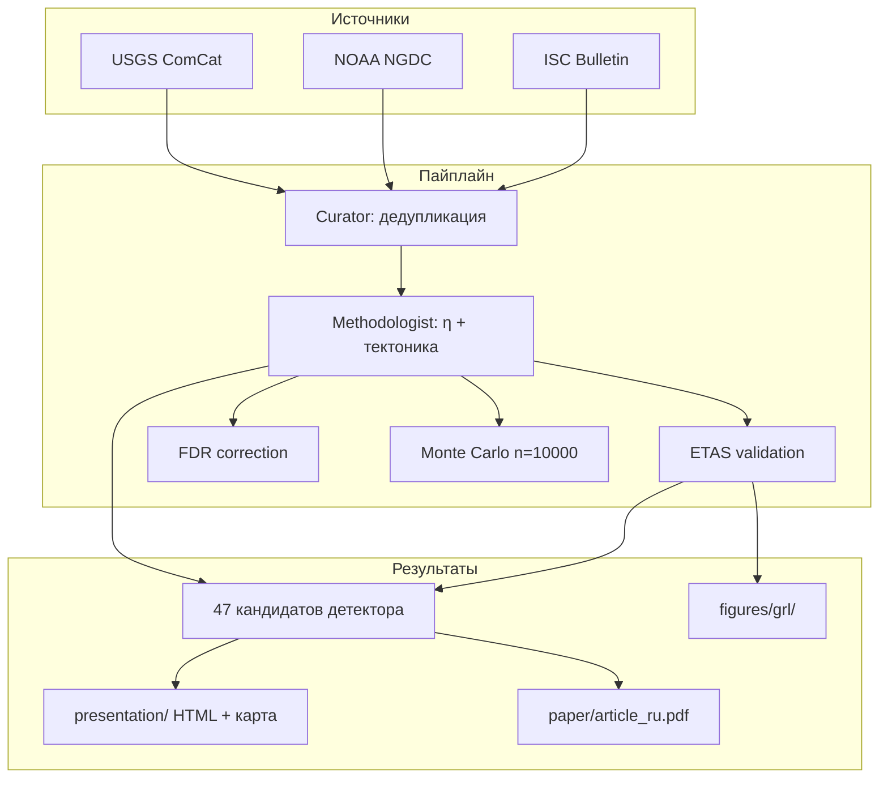

# Paleoseismic Clustering — Документация

> **Глобальные сейсмические серии:** статистический анализ 4267 землетрясений M≥6.5 (4418 записей CSV; основное окно 1973–2026)

**Демо:** [GitHub Pages](https://marshalkin-ux.github.io/paleoseismic-clustering/) · **Статья:** [RU](../paper/article_ru.pdf) · [EN](../paper/article_en.pdf) · **Автор:** [Ярослав Маршалкин](mailto:marshalkin@gmail.com) · Telegram [@MRSHLKN](https://t.me/MRSHLKN)

---

## Описание проекта

**Paleoseismic Clustering** — открытый научный программный комплекс для **проверки (и опровержения) гипотезы** о физически значимых **мультирегиональных глобальных сериях** в исторических и инструментальных каталогах землетрясений.

Метод: метрика ближайшего соседа **Baiesi–Paczuski (2004)** с **эвристической метрикой с тектонической подсказкой** по графу границ плит Bird (2003) вместо евклидова (98% пар — 1,5× GC; отрицательный тест гипотезы).

### Ключевые результаты (июнь 2026) — null/falsification

| Параметр | Значение |
|----------|----------|
| Каталог | 4267 событий M≥6.5 (4418 CSV-записей) |
| Кандидаты детектора | 47 алгоритмических (142 окна до merge; 27 на 1973–2026) |
| Permutation | n = 10 000, p = 0.0001 (1/10 001), z = −6.17 — отвергает пуассоновский нуль по временам |
| ETAS (калибр.) | N_obs=27, mean=27,0, **p_ETAS=1,0**, FPR=1000/1000 — **неотличимо** от ETAS-null |
| Multiseed ETAS | seeds 42–51, n=1000, mean≈27, FPR=1.0 |
| FDR BH (q=0.05) | 45/47 — Methods/sensitivity only |

**Вывод:** применение калиброванной ETAS показывает, что число мультирегиональных кластеров детектора **не превышает** ожидаемого от локальной афтершоковой активности; гипотеза о глобальных сейсмических сериях **не подтверждается**.

> **Депонирование:** Zenodo/Figshare/arXiv отложено; код и данные — на [GitHub](https://github.com/marshalkin-ux/paleoseismic-clustering).

---

## Навигация

| № | Файл | Содержание |
|---|------|-----------|
| — | [index.md](index.md) | Главная страница |
| 1 | [01_data_sources.md](01_data_sources.md) | USGS, ISC, NOAA — загрузка и форматы |
| 2 | [02_unified_format.md](02_unified_format.md) | Унификация, дедупликация, SQLite |
| 3 | [03_methodology.md](03_methodology.md) | η-метрика, серии, Monte Carlo, ETAS, FDR |
| 4 | [04_api_reference.md](04_api_reference.md) | API классов и функций |
| 5 | [05_quickstart.md](05_quickstart.md) | Установка и сквозной пример |
| 6 | [06_results_interpretation.md](06_results_interpretation.md) | Интерпретация результатов |
| 7 | [07_contributing.md](07_contributing.md) | Тесты, стиль кода |
| — | [research_improvements_consultation.md](research_improvements_consultation.md) | План улучшений для GRL/BSSA |
| — | [statistical_testing_plan.md](statistical_testing_plan.md) | План статистических тестов |
| — | [implementation_summary.md](implementation_summary.md) | Сводка реализации A–H |

---

## Архитектура

---

## Статус (июнь 2026)

| Компонент | Статус |
|-----------|--------|
| Загрузка USGS / NOAA / ISC | ✅ |
| Дедупликация, каталог 4418 | ✅ |
| η-кластеризация, кандидаты детектора | ✅ |
| Monte Carlo n = 10 000 | ✅ |
| ETAS-валидация | ✅ |
| FDR Benjamini–Hochberg | ✅ |
| GRL-фигуры, HTML showcase | ✅ |
| GitHub Pages | ✅ |

**Версия:** 1.0.0 · **Python:** ≥ 3.10 · **Лицензия:** MIT

---

## Публикация и депонирование

**Code and data on GitHub; external deposition (Zenodo) deferred.** См. [PUBLICATION_STATUS.md](../publication/output/PUBLICATION_STATUS.md).

---

## Контакты

- Email: [marshalkin@gmail.com](mailto:marshalkin@gmail.com)
- Telegram: [@MRSHLKN](https://t.me/MRSHLKN)
- Репозиторий: [github.com/marshalkin-ux/paleoseismic-clustering](https://github.com/marshalkin-ux/paleoseismic-clustering)
